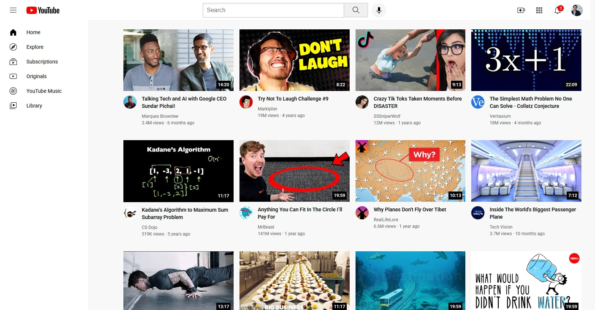
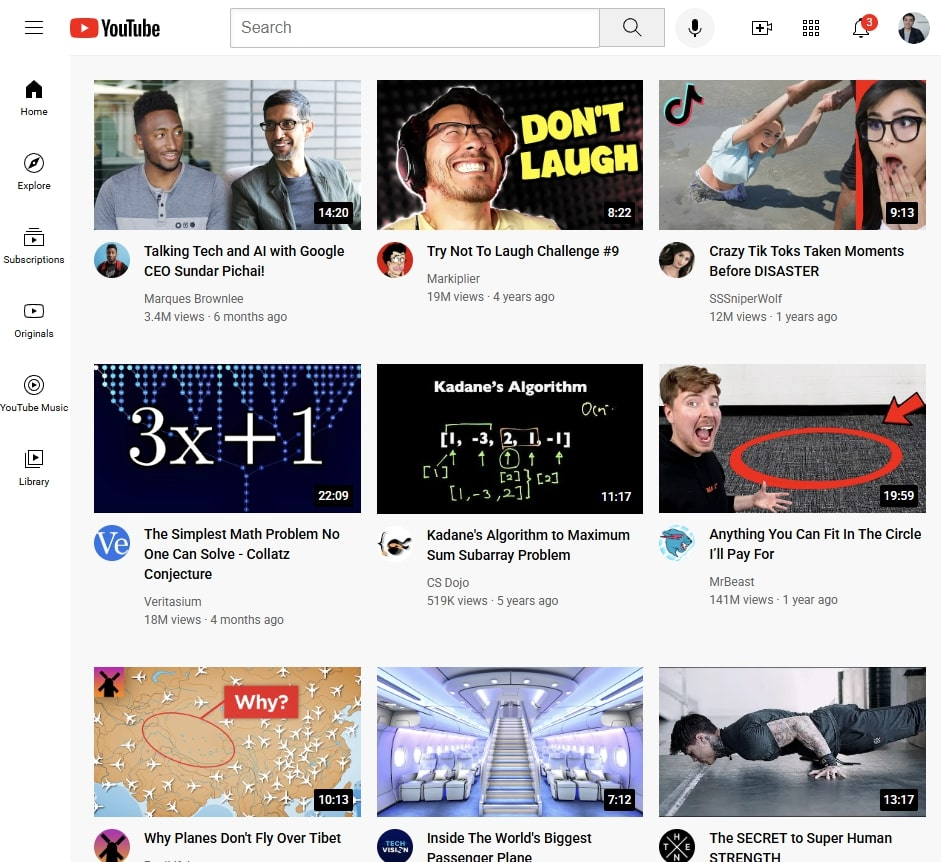
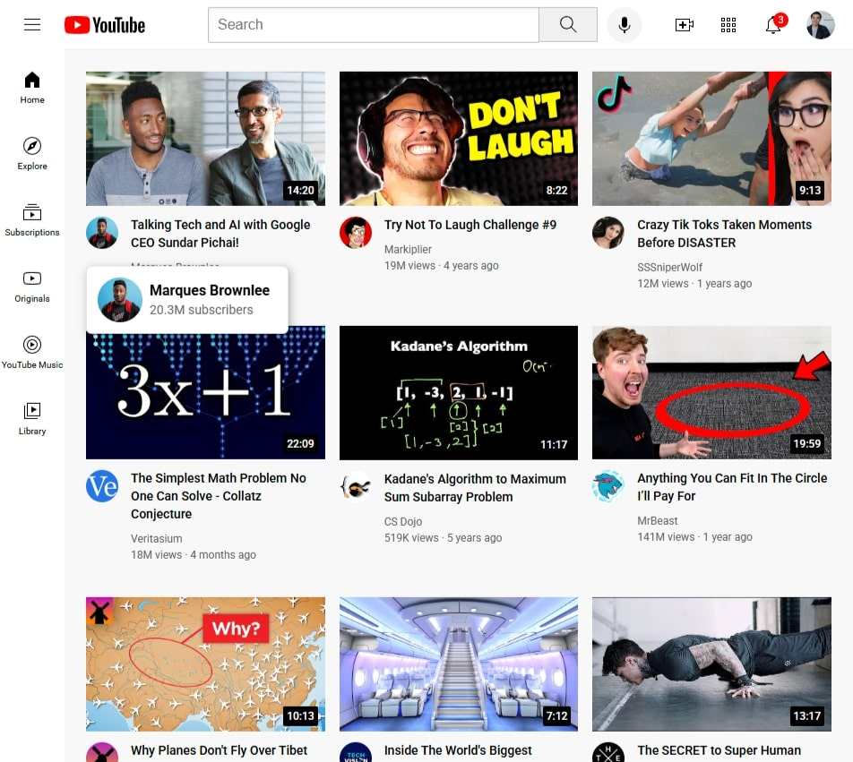

# 🎬 YouTube Frontend

This is my **first web development project**, where I built a **YouTube homepage frontend clone** using only **HTML & CSS**.  
The focus of this project is on **layout, responsiveness, and clean UI design**.

---

## 🚀 Features
- 📌 Responsive sidebar (collapses on smaller screens)  
- 📌 Fixed header with search bar, voice search, and action icons  
- 📌 Video grid layout with thumbnails, durations, and info  
- 📌 Hover tooltips for buttons and channel info  
- 📌 Channel profile hover card with subscriber stats  

---

## 🛠️ Tech Stack
- **HTML5** – page structure  
- **CSS3** – styling, flexbox, grid, responsiveness  
- **Google Fonts (Roboto)** – typography  

---

## 📂 Project Structure
📦 YouTube-Clone
┣ 📂 img
┃ ┣ 📂 icon
┃ ┣ 📂 profile-pic
┃ ┣ 📂 screenshot
┃ ┗ 📂 thumbnails
┣ 📂 styles
┃ ┣ general.css
┃ ┣ header.css
┃ ┣ sidebar.css
┃ ┗ video.css
┣ index.html
┗ README.md

---

## 🎯 How to Run
1. Clone this repository:
   ```bash 
   git clone https://github.com/prem-03829/YouTube_Clone.git
   ```

2. Open the index.html file in any modern web browser.

---

## Screenshot

📸 Expanded Sidebar



📱 Collapsed Sidebar



🎯 Video Grid Layout


---

## 📚 What I Learned
* Structuring a website using semantic HTML

* Building responsive layouts with CSS Flexbox and Grid

* Creating hover effects and tooltips

* Organizing CSS into multiple files for better readability

* Basics of responsive design using media queries

---

## 🌟 Future Improvements
* Add JavaScript for interactivity (search, sidebar toggle, etc.)

* Implement dark mode support

* Expand to other YouTube pages (video player page, subscriptions, etc.)

---

👤 Author
Prem Paramanick
🚀 Taking my first steps into frontend development ❤️